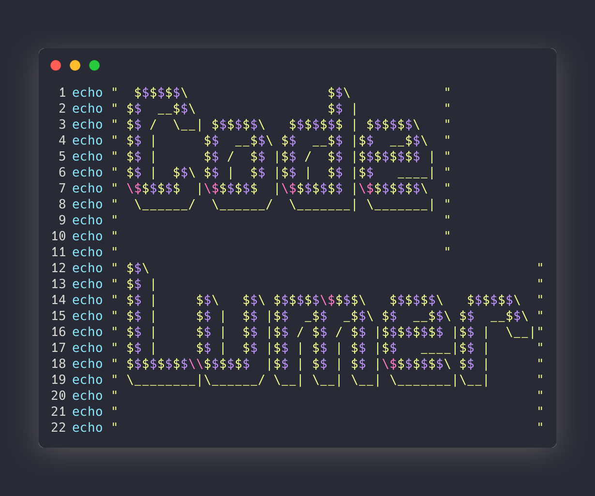

<div align="center">

  # 📸 CodeLumer CLI
  
  **Batch generate beautiful, high-resolution code screenshots from your terminal.**
  
  [](https://www.gnu.org/software/bash/)
  [](https://github.com/Aloxaf/silicon)
  [](LICENSE)

</div>

---

<div align="center">
  
</div>

---

## 🚀 About

**CodeLumer CLI** is a powerful wrapper around the `silicon` rendering engine, designed to automate the process of creating code-style screenshots. 

While browser-based tools are great for one-offs, **CodeLumer CLI** is built for developers who need speed and automation. It can process entire directories of source code in seconds, applying consistent styling, fonts, and window controls to every image.

## ⚡ Support
<div align="center">

**Made with ❤️ and ☕ by the Plantacerium**

[](https://ko-fi.com/plantacerium)

⭐ **Star us on GitHub** if the script is useful to You! ⭐
</div>

## ✨ Features

* **📂 Batch Processing:** Give it a folder, and it automatically finds `.py`, `.rs`, `.js`, `.go`, and more, converting them all at once.
* **🎨 Beautiful Defaults:** Comes pre-configured with the **Dracula** theme, drop shadows, and macOS-style window controls.
* **🔠 Font Control:** Fully supports ligatures (Fira Code, Hack, JetBrains Mono) and custom sizes.
* **🛠 Highly Configurable:** Toggle line numbers, adjust padding, change background colors, and swap themes on the fly.
* **⚡ Blazing Fast:** Powered by Rust (via `silicon`), rendering images instantly without launching a browser.

---

## 📦 Installation

### 1. Install Dependencies
This script relies on `silicon` for the rendering engine.

**macOS (Homebrew):**
```bash
brew install silicon
````

**Linux / Windows (via Cargo):**

```bash
cargo install silicon
```

### 2\. Install CodeSnap

Clone this repo or download the script directly.

```bash
# Download the script
curl -o codelumer.sh [https://raw.githubusercontent.com/plantacerium/CodeLumer/main/codelumer.sh](https://raw.githubusercontent.com/plantacerium/CodeLumer/main/codelumer.sh)

# Make it executable
chmod +x codelumer.sh

# (Optional) Move to global path
sudo mv codelumer.sh /usr/local/bin/codesnap
```

-----

## 💻 Usage

### Basic Usage

Generate a snapshot of a single file using default settings (Dracula theme, 1920px width context).

```bash
sh codelumer.sh --font "Hack; Noto Color Emoji" --size 39 photo-test.sh
```

### Batch Mode (Directory)

Recursively scan a directory and generate snapshots for all supported code files.

```bash
sh codelumer.sh --font "Hack; Noto Color Emoji" --size 39 ./phototest
```

### Customization Examples

**Change Theme and Font:**

```bash
./codelumer.sh --theme Nord --font "JetBrains Mono" --size 28 app.rs
```

**Minimalist Style (No Window Controls or Line Numbers):**

```bash
./codelumer.sh --no-window --no-line-numbers script.js
```

**Custom Output Directory:**

```bash
./codelumer.sh --output ./assets/blog-images ./src
```

-----

## 🎨 Themes & Aesthetics

CodeSnap CLI supports all standard `.tmTheme` syntax highlighting files.

To list all available themes on your machine:

```bash
./codelumer.sh --list-themes
```

> **Tip:** You can install custom themes (like those from [iTerm2-Color-Schemes](https://github.com/mbadolato/iTerm2-Color-Schemes)) by placing `.tmTheme` files in `~/.config/silicon/themes/`.

-----

## 👏 Acknowledgments

This tool stands on the shoulders of giants. A huge thank you to:

  * **[Aloxaf/silicon](https://github.com/Aloxaf/silicon)** - The incredibly fast Rust-based image renderer that powers this script.
  * **[Dracula Theme](https://draculatheme.com/)** - The beautiful default color scheme used in our presets.

-----

## 📄 License

This project is licensed under the MIT License - see the [LICENSE]

## ⚡ Support
<div align="center">

**Made with ❤️ and ☕ by the Plantacerium**

[](https://ko-fi.com/plantacerium)

⭐ **Star us on GitHub** if the script is useful to You! ⭐
</div>

-----
